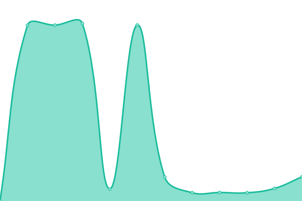
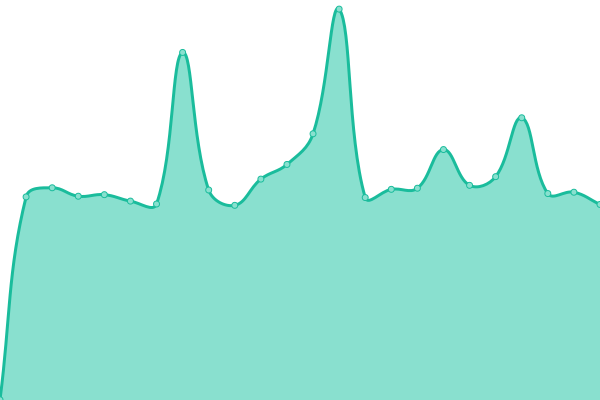

# [📈 status ao vivo](https://guichevirtual.github.io/statuspage): <!--live status--> **🟧 Partial outage**

This repository contains the open-source uptime monitor and status page for [Guichê Virtual](https://www.guichevirtual.com.br), powered by [Upptime](https://github.com/upptime/upptime).

With [Upptime](https://upptime.js.org), you can get your own unlimited and free uptime monitor and status page, powered entirely by a GitHub repository. We use [Issues](https://github.com/guichevirtual/statuspage/issues) as incident reports, [Actions](https://github.com/guichevirtual/statuspage/actions) as uptime monitors, and [Pages](https://guichevirtual.github.io/statuspage) for the status page.

## [📈 Live Status](https://demo.upptime.js.org): <!--live status--> **🟧 Partial outage**

<!--start: status pages-->
<!-- This summary is generated by Upptime (https://github.com/upptime/upptime) -->
<!-- Do not edit this manually, your changes will be overwritten -->
<!-- prettier-ignore -->
| URL | Status | History | Response Time | Uptime |
| --- | ------ | ------- | ------------- | ------ |
|  [Buson Suite](https://buson.com.br/suite) | Não operacional | [buson-suite.yml](https://github.com/guichevirtual/statuspage/commits/HEAD/history/buson-suite.yml) | 

 204ms
     
 | 

<a href="https://status.buson.com.br/history/buson-suite">0.00%</a>
    

|  [Sefaz - Mato Grosso](https://onboardapi.guichepass.com.br/sefaz?code=5) | Operacional | [sefaz-mato-grosso.yml](https://github.com/guichevirtual/statuspage/commits/HEAD/history/sefaz-mato-grosso.yml) | 

 1576ms
     
 | 

<a href="https://status.buson.com.br/history/sefaz-mato-grosso">99.37%</a>
    

|  [Sefaz - Mato Grosso do Sul](https://onboardapi.guichepass.com.br/sefaz?code=4) | Operacional | [sefaz-mato-grosso-do-sul.yml](https://github.com/guichevirtual/statuspage/commits/HEAD/history/sefaz-mato-grosso-do-sul.yml) | 

 875ms
     
 | 

<a href="https://status.buson.com.br/history/sefaz-mato-grosso-do-sul">99.37%</a>
    

|  [Sefaz - Minas Gerais](https://onboardapi.guichepass.com.br/sefaz?code=1) | Operacional | [sefaz-minas-gerais.yml](https://github.com/guichevirtual/statuspage/commits/HEAD/history/sefaz-minas-gerais.yml) | 

 746ms
     
 | 

<a href="https://status.buson.com.br/history/sefaz-minas-gerais">99.37%</a>
    

|  [Sefaz - Paraná](https://onboardapi.guichepass.com.br/sefaz?code=6) | Operacional | [sefaz-parana.yml](https://github.com/guichevirtual/statuspage/commits/HEAD/history/sefaz-parana.yml) | 

 766ms
     
 | 

<a href="https://status.buson.com.br/history/sefaz-parana">99.37%</a>
    

|  [Sefaz - Rio Grande do Sul](https://onboardapi.guichepass.com.br/sefaz?code=2) | Operacional | [sefaz-rio-grande-do-sul.yml](https://github.com/guichevirtual/statuspage/commits/HEAD/history/sefaz-rio-grande-do-sul.yml) | 

 823ms
     
 | 

<a href="https://status.buson.com.br/history/sefaz-rio-grande-do-sul">97.97%</a>
    

|  [Sefaz - São Paulo](https://onboardapi.guichepass.com.br/sefaz?code=3) | Operacional | [sefaz-sao-paulo.yml](https://github.com/guichevirtual/statuspage/commits/HEAD/history/sefaz-sao-paulo.yml) | 

 800ms
     
 | 

<a href="https://status.buson.com.br/history/sefaz-sao-paulo">99.15%</a>
    

<!--end: status pages-->

[**Visit our status website →**](https://guichevirtual.github.io/statuspage)

## 📄 License

- Powered by: [Upptime](https://github.com/upptime/upptime)
- Code: [MIT](./LICENSE) © [Guichê Virtual](https://www.guichevirtual.com.br)
- Data in the `./history` directory: [Open Database License](https://opendatacommons.org/licenses/odbl/1-0/)
